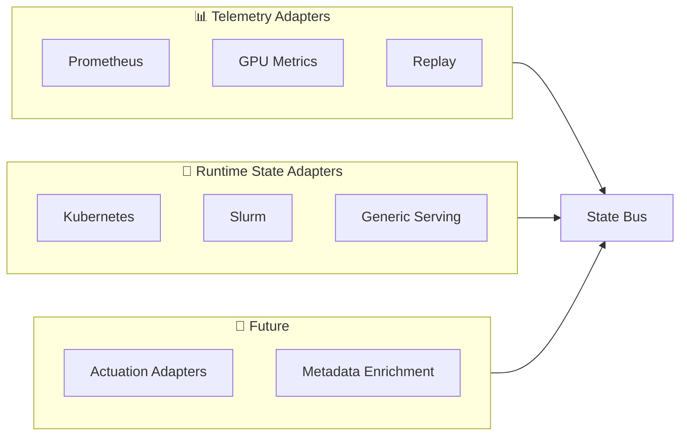

# Adapters

Adapters are OpenAICE's integration layer — they translate tool-specific APIs and protocols into canonical state fragments that the core engine can reason about.

## Adapter Taxonomy



## Adapter Categories

### Telemetry Adapters
Ingest observability signals — metrics, logs, traces. Read-only.

| Adapter | Source | Data Collected |
|---------|--------|---------------|
| **Prometheus** | PromQL API | Latency, throughput, utilization, queue depth |
| **GPU Metrics** | dcgm-exporter via Prometheus | GPU utilization, memory, temperature, ECC errors |
| **Replay** | YAML/JSON files | All entity types (for testing/demos) |

### Runtime State Adapters
Read current infrastructure state from orchestrators and schedulers.

| Adapter | Source | Data Collected |
|---------|--------|---------------|
| **Kubernetes** | K8s API (or mock) | Deployments, Nodes, Services, resource state |
| **Slurm** | CLI/REST/Mock | Jobs, Nodes, Queues, partition state |
| **Generic Serving** | Prometheus | Standard serving metrics (latency, RPS, errors) |

### Actuation Adapters (v2)
Execute approved recommendations against live infrastructure. Not yet implemented.

### Metadata Enrichment (v2)
Enrich entities with additional context (model registries, experiment trackers).

## Abstract Base Classes

All adapters implement one of these contracts:

```python
class TelemetryAdapter(ABC):
    """Ingest observability signals."""

    @abstractmethod
    def initialize(self, config: dict) -> None: ...

    @abstractmethod
    def collect(self) -> list[dict]: ...

    @abstractmethod
    def health_check(self) -> bool: ...


class RuntimeStateAdapter(ABC):
    """Read current infrastructure state."""

    @abstractmethod
    def initialize(self, config: dict) -> None: ...

    @abstractmethod
    def snapshot(self) -> list[dict]: ...

    @abstractmethod
    def health_check(self) -> bool: ...
```

## Configuration

Each adapter is enabled/disabled in the YAML config:

```yaml
prometheus:
  enabled: true
  url: http://localhost:9090

kubernetes:
  enabled: true
  namespaces: [prod, ml-serving]

slurm:
  enabled: false
```
