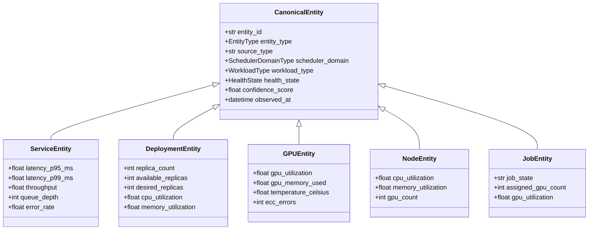

# Canonical State Model

The canonical state model is the **universal bridge** between diverse infrastructure systems and the policy engine. All adapters normalize their data into these entity types — the policy engine never sees raw API payloads.

## Entity Type Hierarchy



## All 12 Entity Types

| Entity Type | Key Fields | Primary Source |
|------------|-----------|---------------|
| `service` | latency, throughput, queue depth, error rate | Prometheus, Generic Serving |
| `deployment` | replicas (current/available/desired), resource utilization | Kubernetes |
| `gpu` | utilization, memory, temperature, ECC errors | dcgm-exporter |
| `node` | CPU, memory, GPU count, health state | Kubernetes, Slurm |
| `job` | job state, assigned GPUs, utilization | Slurm, Kubernetes |
| `queue` | pending/active jobs, queue depth | Slurm |
| `model_revision` | version, serving state, rollout phase | Kubernetes, Custom |
| `scheduler_domain` | domain type (k8s/slurm), capacity | Runtime adapters |
| `tenant_scope` | namespace/partition, quota, usage | Kubernetes, Slurm |
| `experiment_tracker` | run state, metrics, artifacts | MLflow, W&B (future) |
| `data_pipeline_stage` | stage state, throughput, lag | Custom (future) |
| `config_snapshot` | config hash, drift detection | Custom (future) |

## Scheduler Domains

| Value | Infrastructure |
|-------|---------------|
| `kubernetes` | K8s clusters |
| `slurm` | Slurm HPC clusters |
| `cloud_managed` | Cloud ML platforms |
| `standalone` | Bare-metal or VM deployments |

## Health States

| State | Meaning | Policy Effect |
|-------|---------|--------------|
| `healthy` | Operating normally | No action needed |
| `warning` | Early degradation signals | Monitor more closely |
| `degraded` | Performance impacted | Recommend corrective action |
| `critical` | Immediate attention required | Urgent recommendation (high priority) |
| `unknown` | Insufficient data | Lower confidence score |

## State Fragments

Adapters don't create full entities directly — they emit **state fragments** that get merged by the State Bus:

```python
StateFragment(
    source_type="prometheus",
    entity_type=EntityType.SERVICE,
    entity_id="inference-api",
    observed_at=datetime.utcnow(),
    fields={"latency_p95_ms": 142.0, "queue_depth": 46},
    labels={"namespace": "prod", "cluster": "us-east-1"},
)
```

The State Bus:

1. Creates new entities from the first fragment for an `entity_id`
2. Merges subsequent fragments (newer data wins)
3. Rejects stale fragments (older than the current entity)
4. Tracks freshness per entity
