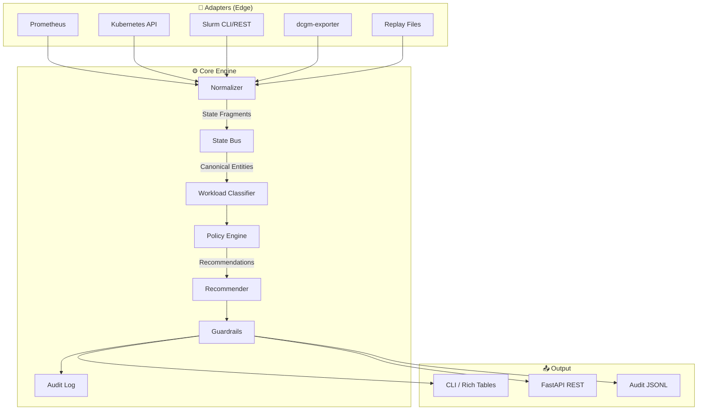
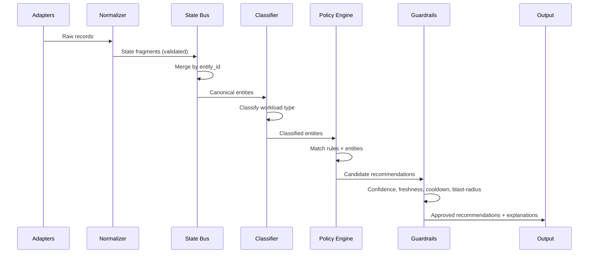

# Architecture Overview

OpenAICE follows a **layered architecture** with strict separation between data collection (adapters), state management (bus), decision-making (policy engine), and safety (guardrails).

## System Architecture

## Pipeline Flow

The control plane operates as a **sequential pipeline** on each evaluation cycle:

## Key Design Principles

### 1. Integration Logic Stays at the Edge
Adapters handle all tool-specific translation. The core engine never sees raw Prometheus metrics or Kubernetes API objects — only canonical entities.

### 2. Policy is Data, Not Code
Decision rules live in `policies/rules.yaml`, not in Python source. This means:

- Non-engineers can review and modify policies
- Rules can be version-controlled independently
- Different environments can use different rule sets

### 3. Safety is Non-Negotiable
Every recommendation passes through 4 guardrails:

| Guardrail | What it checks |
|-----------|---------------|
| **Confidence threshold** | Entity confidence ≥ minimum for the action |
| **Data freshness** | Telemetry data is recent enough to act on |
| **Cooldown window** | Enough time has passed since last action on this entity |
| **Blast-radius limit** | Total entities affected per cycle doesn't exceed the cap |

### 4. Explainability by Default
Every recommendation includes:

- `rule_id` — which YAML rule fired
- `reason` — human-readable explanation
- `signals_used` — what telemetry signals triggered it
- `objectives_impacted` — which business objectives are affected
- `confidence_score` — how confident the system is

## Module Responsibilities

| Module | File | Responsibility |
|--------|------|---------------|
| **Normalizer** | `core/normalizer.py` | Converts raw adapter records into typed `StateFragment` objects |
| **State Bus** | `core/state_bus.py` | In-memory store that merges fragments by entity_id, tracks freshness |
| **Classifier** | `core/workload_classifier.py` | Assigns scenario family (e.g., `online_inference`, `hpc_research`) |
| **Policy Engine** | `core/policy_engine.py` | Evaluates YAML rules against classified entities |
| **Recommender** | `core/recommender.py` | Scores recommendations and generates structured explanations |
| **Guardrails** | `core/guardrails.py` | Enforces safety constraints before any recommendation is surfaced |
| **Audit Log** | `core/audit_log.py` | Writes immutable JSONL records for every recommendation lifecycle event |
