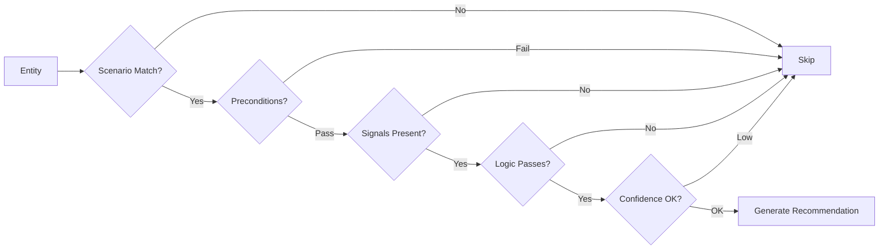

# Policy Engine

The policy engine is the **decision-making core** of OpenAICE. It evaluates YAML-defined decision rules against canonical entities and produces explainable recommendations.

## How It Works



For each entity × rule combination, the engine runs 5 checks:

1. **Scenario match** — Does the rule's `scenario_family` match the entity's workload type?
2. **Preconditions** — Do field comparisons pass? (e.g., `workload_type == online_inference`)
3. **Signal presence** — Are all required signals non-null on the entity?
4. **Logic evaluation** — Does the rule-specific logic fire? (e.g., latency > threshold AND queue > minimum)
5. **Confidence gate** — Is the entity's confidence score ≥ the rule's minimum?

## Rule Structure

```yaml
rules:
  - rule_id: infer_scale_up_on_queue_pressure    # Unique identifier
    scenario_family: kubernetes_online_inference   # Which workloads this applies to
    preconditions:                                 # Field-level guards
      - "workload_type == online_inference"
      - "scheduler_domain == kubernetes"
    required_signals:                              # Must be non-null
      - latency_p95_ms
      - queue_depth
    recommended_action:
      action_type: scale_replicas
      parameters:
        direction: up
        max_increment: 3
    risk_level: medium
    minimum_confidence: 0.75
    reason: "p95 latency exceeded target ({entity_id})"
    expected_benefit: "Reduced queueing delay"
```

## Built-in Rules

| Rule ID | Scenario | Trigger Condition | Action |
|---------|----------|------------------|--------|
| `infer_scale_up_on_queue_pressure` | K8s Inference | p95 > target AND queue > min | `scale_replicas` up |
| `infer_adjust_batching_before_scale_out` | LLM/Inference | Queue high but GPU underused | `adjust_batching` |
| `hpc_quarantine_unhealthy_node` | HPC/Training | Node health degraded | `quarantine_node` |
| `enable_scale_to_zero_for_idle_service` | Managed Serving | Near-zero throughput | `enable_scale_to_zero` |
| `recommend_no_action_low_confidence` | Any | Confidence below threshold | `recommend_no_action` |

## Scenario Family Mapping

| Scenario Family | Matching Workload Types |
|----------------|----------------------|
| `kubernetes_online_inference` | `online_inference` |
| `llm_or_inference_serving` | `llm_serving`, `online_inference` |
| `hpc_or_training` | `hpc_research`, `distributed_training` |
| `managed_or_kserve_serving` | `online_inference`, `llm_serving` |
| `batch` | `batch_inference` |
| `any` | All workload types |

## All 14 Action Types

| Action | Risk Level | Use Case |
|--------|-----------|----------|
| `scale_replicas` | Medium | Horizontal scaling |
| `adjust_batching` | Medium | Batching/concurrency tuning |
| `rebalance_traffic` | Medium | Traffic distribution |
| `trigger_canary_rollback` | High | Rollback bad deployment |
| `quarantine_node` | High | Remove unhealthy hardware |
| `preempt_job` | High | Priority-based preemption |
| `enable_scale_to_zero` | Low | Cost savings for idle services |
| `adjust_priority_or_quota` | Medium | Fairness adjustments |
| `drain_and_replace_node` | Critical | Node replacement |
| `adjust_resource_limits` | Medium | CPU/memory/GPU limits |
| `configure_autoscaler` | Medium | Auto-scaler parameters |
| `enable_spot_fallback` | Medium | Cost optimization |
| `adjust_checkpoint_frequency` | Low | Training reliability |
| `recommend_no_action` | Low | Safety fallback |

## Thresholds

Thresholds are loaded from the policy pack YAML:

```yaml
thresholds:
  target_p95_ms: 200            # p95 latency target
  target_p99_ms: 500            # p99 latency target
  target_gpu_utilization: 0.55  # GPU utilization target
  min_queue_depth_for_scale: 10 # Queue depth to trigger scaling
  idle_throughput_threshold: 1.0 # Below this = idle
```
